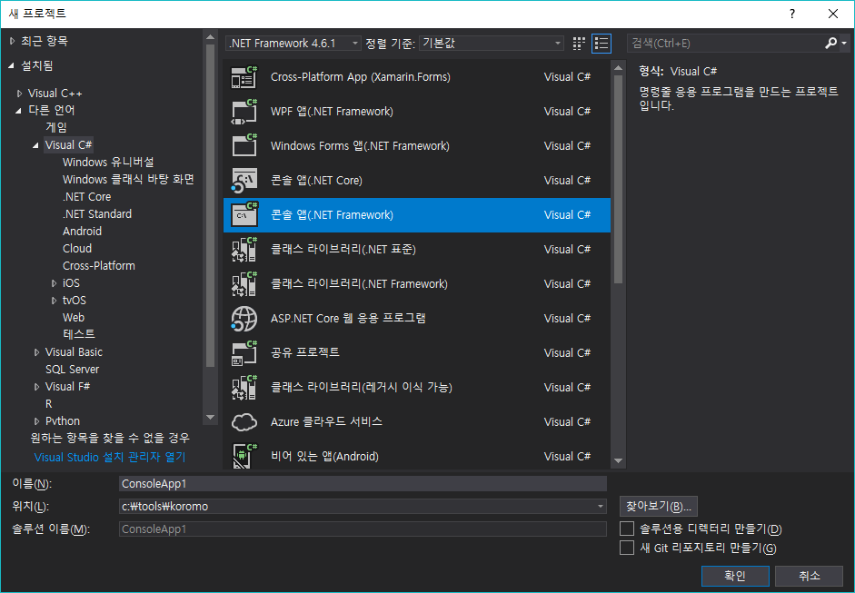
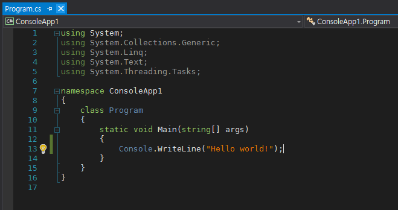
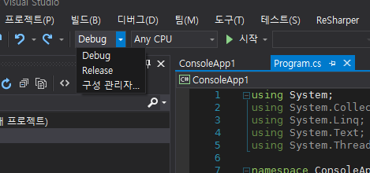
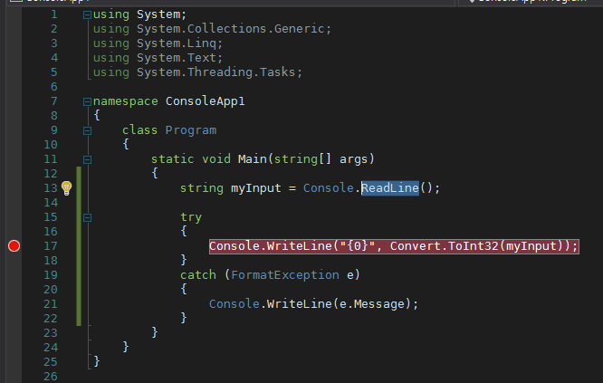
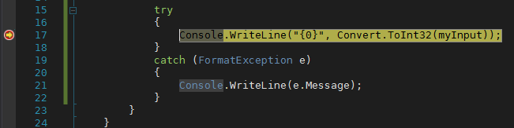
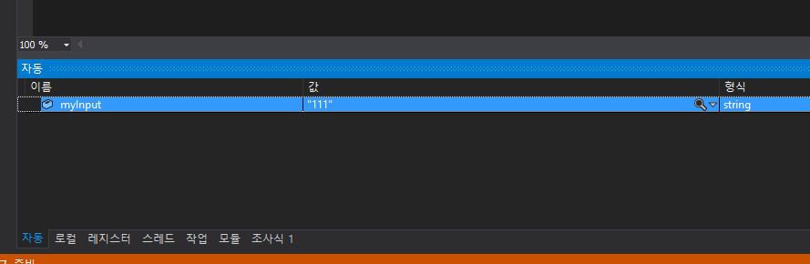
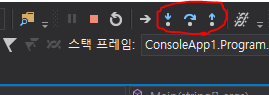

# 콘솔 입출력

<p align="center">
  
</p>

`C`, `C++`에 익숙하신 분이라면 콘솔 또한 익숙하리라 생각합니다. 콘솔은 가장 간단한 프로그램 실행환경이며, 어느 플랫폼이든 비슷한 형태를 가지고 있습니다. 모든 프로그래밍 언어는 이러한 콘솔 입출력을 제어하는 방법들을 제공합니다. 따라서 어떤 새로운 언어를 시작하려면 해당 언어의 콘솔 입출력 방법을 아는 것이 가장 중요하다고 생각합니다. 눈에 보이는게 있어야 제대로 작동하는지 확인도 할 수 있고 재미도 있으니깐요!

## 콘솔 프로젝트 만들기

`파일->새로 만들기->프로젝트`를 클릭하고난뒤,

<p align="center">
  
</p>

위와 같이 `콘솔 앱(.NET Framework)`를 선택하고 새로운 프로젝트를 만들어 줍니다.
다음과 같은 창이 뜬다면 성공한겁니다!

<p align="center">
  
</p>

## 콘솔 출력

``` csharp
static void Main(string[] args)
{
    Console.WriteLine("Hello world!");
    Console.ReadLine();
}
```

위 코드를 입력하고, 상단 메뉴바에서 `디버그->디버깅 시작`이나 키보드 `F5` 키를 눌러 프로젝트를 빌드하고, 프로그램을 실행해보세요! `Hello world!`가 정상적으로 출력된다면 성공입니다~!

콘솔에 관한 모든 함수들은 `Console` 클래스 안에 포함되어 있습니다. 표준입출력이나 출력 콘솔 설정, 출력 글자의 색상이나 배경색 등 모든 것들이 말이죠. 좀더 세분화 시킨다면, `Console.Out`에 표준 출력 함수들이, `Console.In`에 표준 입력 함수들이 들어있습니다.

다음은 콘솔 출력에 관한 함수들을 정리한 표입니다.

| 함수 이름             | 용도                                        |
| ----------------- | ----------------------------------------- |
| Console.Write     | 어떤 문자나 숫자, 문자열을 출력합니다.                    |
| Console.WriteLine | 어떤 문자나 숫자, 문자열을 출력한뒤 개행하고 커서를 맨 앞으로 옮깁니다. |

콘솔 출력은 이 두 가지가 전부입니다. 이 두 가지만 있으면 모든 출력 부분 코드를 작성하는데 전혀 문제가 없습니다!

딸랑 저거 두 개 밖에 없다면 심심하니깐 과제를 하나 내드리죠.
여기서 이 두 함수가 제공하는 특별한 기능 하나를 알려드리겠습니다.
어떤 기능인지 알아내는게 이번 과제입니다!

``` csharp
static void Main(string[] args)
{
    int a = 10;
    string b = "plus";
    int c = 20;

    Console.WriteLine("덧셈: {0} {1} {2} = {3}", a, b, c, a + c);
    Console.WriteLine($"덧셈: {a} {b} {c} = {a + c}");
    Console.ReadLine();
}
```

위 코드를 입력하고 실행해보세요! 콘솔창에 `덧셈: 10 plus 20 = 30`이 보이시나요?

## 콘솔 입력

콘솔 입력은 콘솔 출력보다도 간단합니다.

``` csharp
static void Main(string[] args)
{
    string myInput = Console.ReadLine();
    Console.WriteLine(myInput);
}
```

위 코드를 실행해보세요! `ReadLine`함수는 한 줄에 입력된 문자열을 받아와 `string` 형식으로 넘겨줍니다.
무조건 `string`형식으로 넘어오기 때문에 `int`와 같은 다른 형식으로 가져오려면 `string`을 `int`로 변환해야합니다.

``` csharp
static void Main(string[] args)
{
    string myInput = Console.ReadLine();
    int myInteger;
    if (int.TryParse(myInput, out myInteger))
    {
        Console.WriteLine("{0}", myInteger);
    }
}
```

위 코드는 사용자에게 입력을 받아와 `int`형식으로 바꾸는 코드입니다.
만약, `myInput`을 `int`형식으로 바꿀 수 있다면 `myInteger`변수에 값을 넣고, `true`를 출력합니다.
그렇지 않다면 `false`를 출력합니다. 또한 다음과 같은 방법을 사용해도 변환할 수 있습니다.

``` csharp
static void Main(string[] args)
{
    string myInput = Console.ReadLine();
    Console.WriteLine("{0}", Convert.ToInt32(myInput));
}
```

이 방법은 조금 위험한 방법입니다. 왜냐하면 `myInput`이 숫자가 아닐 수도 있기 때문이죠.
`try-catch-finally` 구문을 아시나요? 어떤 언어에서는 `try-catch`만 지원하기도 합니다.
어쨋든 이 구문을 활용하면 문제없이 변환할 수 있습니다.

``` csharp
static void Main(string[] args)
{
    string myInput = Console.ReadLine();

    try
    {
        Console.WriteLine("{0}", Convert.ToInt32(myInput));
    }
    catch (FormatException e)
    {
        Console.WriteLine(e.Message);
    }
}
```

`Convert.ToInt32`는 `FormatException`과 `OverflowException`이라는 `Exception`기반의 클래스를 `throw`할 수 있는 함수입니다. 따라서 숫자 형식이 아니면 `FormatException`을 `throw`하게 되고, 이를 `catch (FormatException e)`를 통해 잡게되는 것이죠. 그리고 `FormatException`이 `Exception` 기반의 클래스이니깐, `Exception`으로 `catch`해도 전혀 문제될 것이 없습니다.

다음 표는 콘솔 입력에 관한 함수들을 정리한 표입니다.

| 함수 이름          | 용도                 |
| ---------------- | ------------------ |
| Console.Read     | 어떤 문자 하나를 입력받습니다.  |
| Console.ReadKey  | 어떤 기능키 하나를 입력받습니다. |
| Console.ReadLine | 어떤 문자열을 입력받습니다.    |

기능키는 `Ctrl + Z`나 `Ctrl + C`같은 콘솔을 제어할 수 있는 단축키들을 말합니다.

## 강력한 디버깅 기능 탐험하기

간단하게 프로그램도 만들어봤으니 `Visual Studio`의 강력한 디버깅 기능을 소개해드릴께요.
디버깅이란 보통 프로그램의 오류/버그를 탐지하기 위한 온갖방법들을 뜻하는데, `Visual Studio`는 코드단위의 디버깅을 지원합니다.
즉, `C#` 언어를 통해 직접 디버깅할 수 있다는 말이죠.

먼저, 빌드 모드를 `Debug`로 바꿉니다.

<p align="center">
  
</p>

아마 기본적으로 `Debug` 모드로 되어있을 테니 따로 만질 필요는 없을 꺼예요.
거의 모든 컴파일러는 크게 `Debug`와 `Release` 두 가지 모드의 빌드를 지원합니다.
`Debug` 모드는 단어 그대로 `Debug`를 효과적으로 처리할 수 있게 도와주게끔 빌드하는 것이고,
`Release`는 사용할 수 있는 최적화방법을 총 동원하여 가장 빠르고, 가장 가벼운 프로그램을 만들기 위한 모드입니다.

그런 다음 아래와 같이 빨간색 공처럼 표시된 곳을 눌러주세요.

<p align="center">
  
</p>

여러분에겐 빨간색 공이 없을 테니, 빨간색 공이 있는 위치 그 자체를 누르면됩니다.
그러면 빨간색 표시의 `Break Point`가 생성됩니다.
`Break Point`는 디버거또는 `CPU`가 해당 지점을 발견하면 프로그램 진행을 멈추고 디버깅을 지원해주기 위한 지점입니다.

이제 `F5`키를 눌러 프로그램을 실행하고, 아무거나 입력 후 엔터키를 누르면

<p align="center">
  
</p>

위와 같이 `Break Point` 지점이 노란색으로 변경됩니다.

<p align="center">
  
</p>

이제 여러분은 `Visual Studio`하단의 `자동`과 `로컬` 탭을 통해 변수의 상태를 볼 수 있습니다.
또한 `F10`, `F11`을 통해 다음 지점으로 노란색 지점을 움직일 수 있습니다.

또는,

<p align="center">
  
</p>

위 버튼들을 통해 노란색 지점을 움직일 수 있습니다.