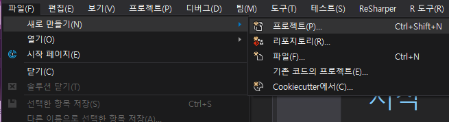
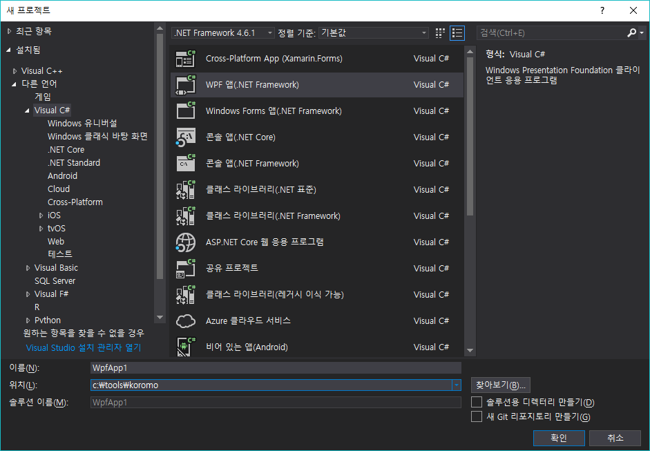
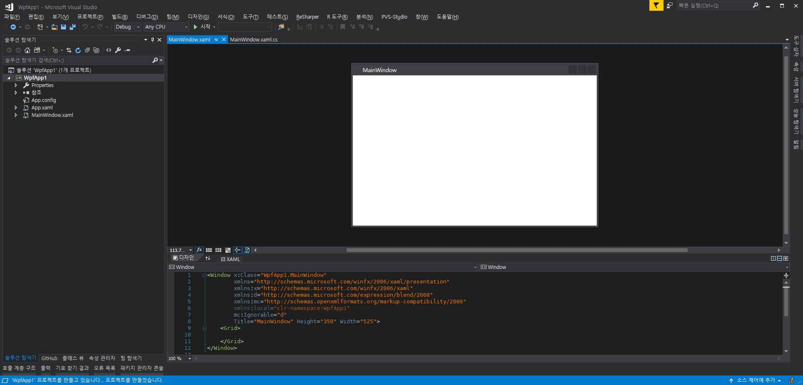
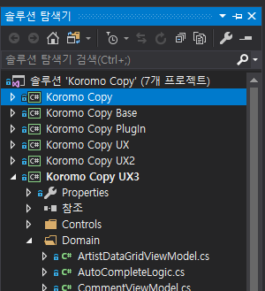
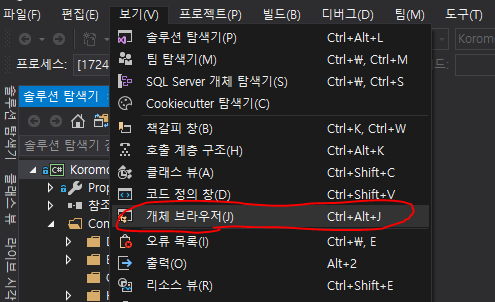
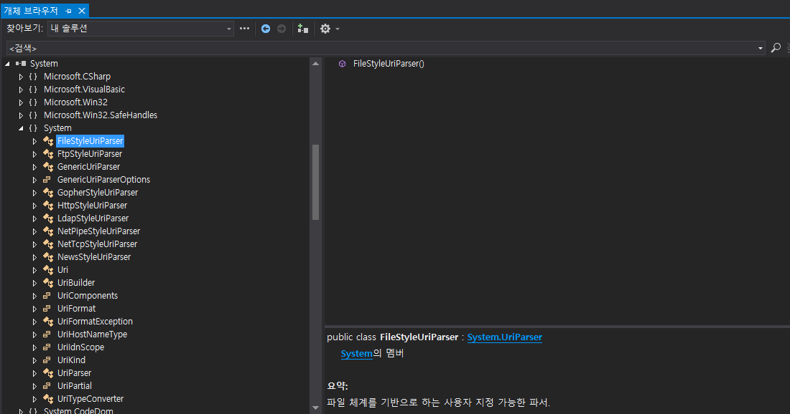
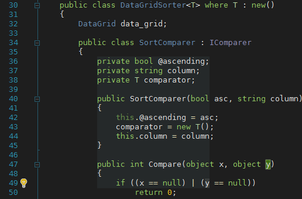

# Visual Studio와 C#

  

C#을 효율적으로 사용하기 위해선 Visual Studio에 익숙해져야 합니다!

지금 바로 Visual Studio Community를 설치하세요!

https://visualstudio.microsoft.com/ko/vs/community/

## Visual Studio를 사용해야하는 이유

앞으로의 모든 강의는 `Visual Studio`를 기반으로 설명합니다.
`Visual Studio`가 아닌 다른 에디터를 사용한다면, 과정을 진행하는데 무리가 있을 수 있습니다.

## 솔루션과 프로젝트

`Visual Studio`에서 말하는 프로젝트는 바이너리 한 개를 담당하는 코드 모음을 말합니다. 즉, 프로젝트 하나를 빌드하면 하나의 바이너리가 만들어집니다. 솔루션은 이런 프로젝트들을 한 개 또는 그 이상을 사용하여 프로젝트를 관리할 때 사용하는 단위입니다. 솔루션은 보통 단일 파일 하나의 형태이며, 하위 프로젝트들에 대한 정보를 담고 있습니다.

온갖 코드를 프로젝트에 다 때려박으면 솔루션에 프로젝트가 하나만 있어도 충분할 것입니다. 하지만, 다른 프로그램 프로젝트와의 이식성이나 바이너리의 크기를 고려한다면 이는 적절하지 못한 선택입니다.

## 새로운 프로젝트 만들기

먼저 `파일->새로 만들기->프로젝트`를 클릭합니다.

  

그런 다음 원하는 프로젝트의 형식을 선택하고 이름과 경로를 설정한 뒤 확인버튼을 누르면 프로젝트가 생성됩니다.
새로운 프로젝트를 만들면 해당 프로젝트의 이름을 가진 솔루션이 자동으로 만들어집니다.

  

  

이제 개발을 시작하면 됩니다!

## 솔루션 탐색기

  

솔루션 탐색기는 솔루션과 프로젝트를 관리하는데 사용할 수 있는 유용한 도구입니다.

## 개체 브라우저 (Object Browser)

보기->개체 브라우저를 통해 개체 브라우저를 실행할 수 있습니다.

  

또는 `Ctrl + Alt + J`를 눌러도 됩니다.

  

개체 브라우저는 제대로된 문서가 없는 오픈소스를 사용하거나, 라이브러리의 구조를 파악하고자 할 때 유용합니다. 개체 브라우저의 객체들은 `바이너리->네임스페이스->클래스->멤버` 순으로 표시되며, `enum`같은 열거형 객체도 볼 수 있습니다.

## 텍스트 에디터

  

`Visual Studio`는 매우 편리하고 강력한 텍스트 에디터를 탑재하고 있습니다.
그 모든 기능을 여기에 전부 적는 것은 무리이니 몇 가지 편리한 기능들만 알려드리겠습니다.

`Column Selection` 기능은 코드를 드래그할 때 기둥을 세워 드래그 하는 방법입니다.
위 텍스트 에디터 소개 사진으로 보여드린 기능이 바로 `Column Selection`입니다. 사용방법은 간단합니다.
`Alt`키를 누를 채로 드래그하면 됩니다.

`VSCode`, `Vim`, `Emacs`를 써본 분이라면 `Clang-Tidy`가 익술할지도 모르겠습니다. `Visual Studio`에는 `Clang-Tidy`와 같이 일정한 코드 포맷을 맞춰주는 기능이 있습니다. `Ctrl + K, Ctrl + D`를 누르면 문서의 서식이 자동으로 맞추어집니다. 원하는 영역의 서식만 맞추려면 원하는 영역을 선택하고 `Ctrl + K, Ctrl + F`를 누르면 됩니다.

원하는 영역을 주석처리하고 싶을 때가 있을 겁니다. 그럴 경우엔 원하는 영역을 드래그하고 `Ctrl + K, Ctrl + C`를 누르면 됩니다. 주석을 해제하고 싶으면 `Ctrl + K, Ctrol + U`를 누르면 됩니다.