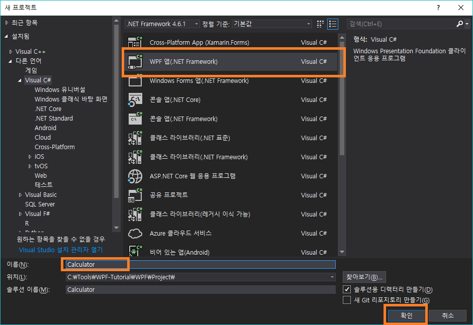
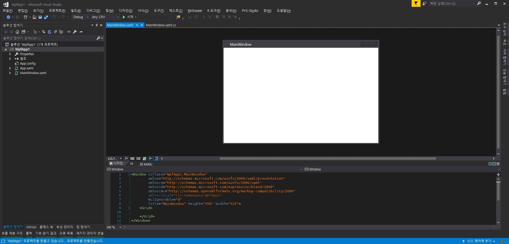
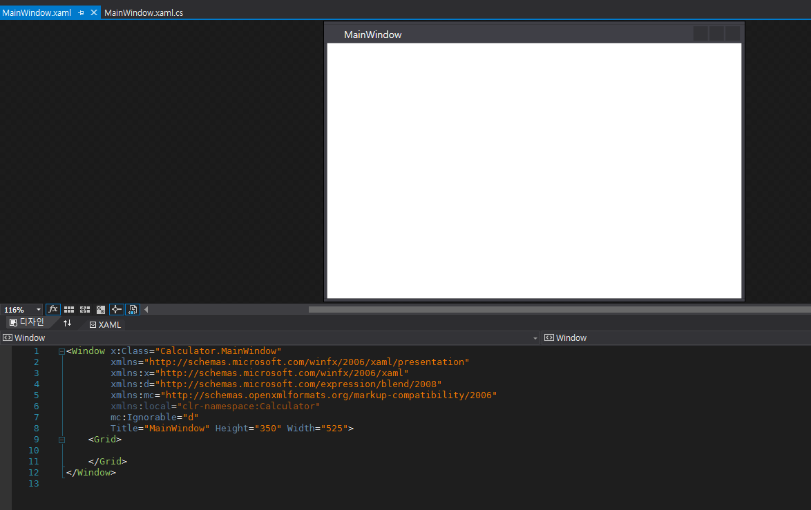
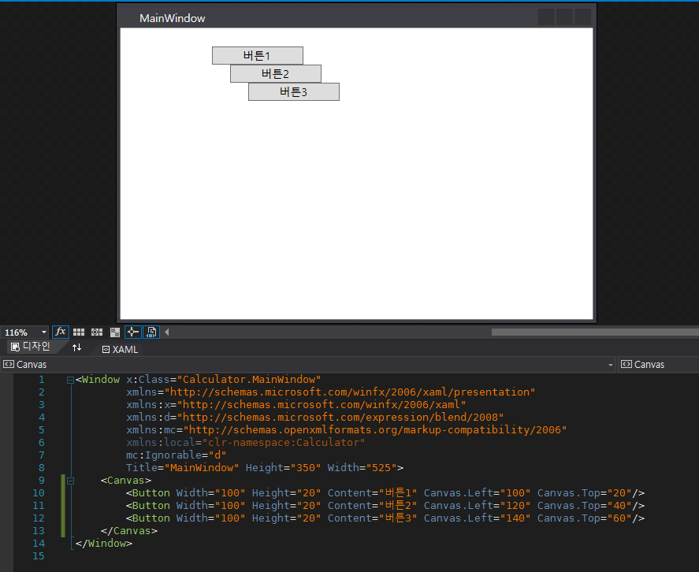
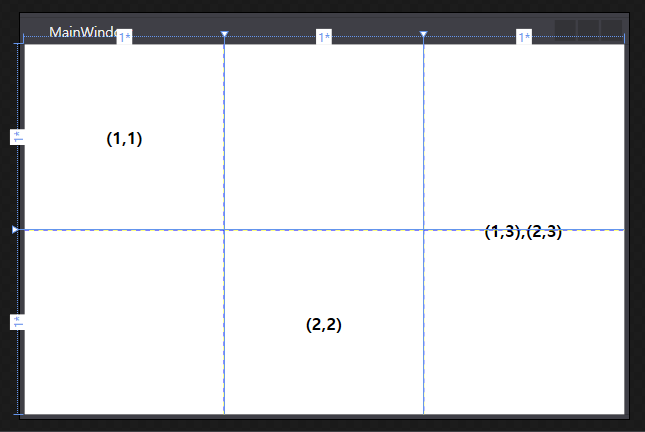
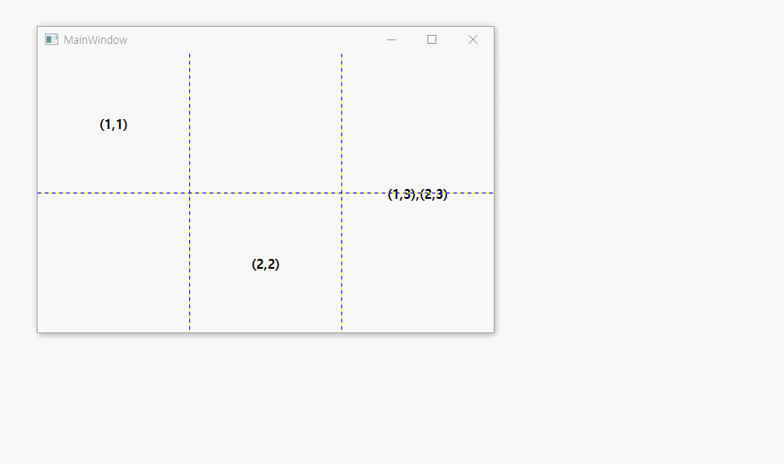

# Grid로 계산기를 만들어보자!

이 문서는 WPF를 처음 시작하시는 분들을 위해 작성되었습니다.

## 프로젝트 만들기

`Ctrl + Shift + N`을 눌러 새 프로젝트 창을 띄워주세요.

<p align="center">
  
</p>

그 다음 위와 같이 `WPF 앱`을 선택하고, 솔루션 이름을 입력한뒤 확인을 눌러주세요.

<p align="center">
  
</p>

개발준비는 모두 끝났습니다!

## 디자인? XAML?

<p align="center">
  
</p>

`WPF`로 응용프로그램을 디자인하는 방법은 크게 두 가지가 있습니다.
`블렌더`냐, `XAML`이냐.
`블렌더`는 디자이너가 응용프로그램을 디자인하기 쉽게 고안된 툴이며, `XAML`은 디자이너나 개발자모두가 디자인하기 쉽게 고안된 마크업 언어입니다.
`XAML`은 `XML`기반의 언어라 `HTML`에 익숙하신 분이라면 쉽게 사용하실 수 있을 것이라 생각해요.
`블렌더`의 경우 저는 사용해보지 않아서 자세한 사용법은 알려드릴 수가 없겠네요 ㅠㅠ

## Window

`WPF` 프로젝트를 처음생성하면 다음과 같은 `XAML`코드를 볼 수 있습니다.

``` xaml
<Window x:Class="Calculator.MainWindow"
        xmlns="http://schemas.microsoft.com/winfx/2006/xaml/presentation"
        xmlns:x="http://schemas.microsoft.com/winfx/2006/xaml"
        xmlns:d="http://schemas.microsoft.com/expression/blend/2008"
        xmlns:mc="http://schemas.openxmlformats.org/markup-compatibility/2006"
        xmlns:local="clr-namespace:Calculator"
        mc:Ignorable="d"
        Title="MainWindow" Height="350" Width="525">
    <Grid>
        
    </Grid>
</Window>
```

`<Window> ~ </Window>`는 단어 뜻 그대로 `창` 그 자체를 나타내며, 창의 `TopMost`여부나, `Transparent` 여부, `WindowStartUpPosition`, `Title` 등을 설정할 수 있습니다.

`Window`는 단 하나의 컨트롤만 컨텐츠로 포함할 수 있습니다.

## 레이아웃

`레이아웃`은 건물, 정원 등의 배치도나 구상도를 말할 때 주로 쓰입니다.
`WPF`에서의 `레이아웃`은 컨트롤들의 배치방법을 나타내는 컨트롤입니다.
모든 레이아웃은 `Panel`을 상속받습니다.

### Panel

모든 레이아웃이 `Panel`을 상속받지만 여기선 `StackPanel`, `DockPanel`과 같이 컨트롤의 이름이 `Panel`로 끝나는 것들을 `Panel`로 부르겠습니다. `Panel`은 종류가 많아 다른 문서에서 설명할께요.

### Canvas

`Canvas`는 `Canvas.Top`, `Canvas.Left`, `Canvas.Right`, `Canvas.Bottom`라는 네 개의 값을 이용해 컨트롤들을 배치시키는 레이아웃입니다.

`Window`의 경우 보통 레이아웃을 보통 `Grid`로 설정하여 디자인을 하지만, 대화창같은 특별한 경우엔 다른 레이아웃을 쓰는 경우도 있습니다.

<p align="center">
  
</p>

``` xaml
<Canvas>
    <Button Width="100" Height="20" Content="버튼1" Canvas.Left="100" Canvas.Top="20"/>
    <Button Width="100" Height="20" Content="버튼2" Canvas.Left="120" Canvas.Top="40"/>
    <Button Width="100" Height="20" Content="버튼3" Canvas.Left="140" Canvas.Top="60"/>
</Canvas>
```

위 사진은 `Canvas`를 사용해 버튼들을 배치하는 모습입니다.
`Canvas.Left`값은 `Canvas` 직사각형에서 왼쪽으로부터 떨어진거리, `Canvas.Top`값은 `Canvas` 직사각형의 위쪽에서부터 떨어진거리입니다.
캔버스는 이처럼 절대좌표를 사용하여 컨트롤들의 크기들이 변경되면 안되는 곳에서 주로 사용합니다.

### Grid

`Grid`는 테이블 방식의 배치방법을 가진 레이아웃입니다.
`Grid`는 모든 레이아웃을 통틀어 가장 많이 쓰이는 레이아웃이라고 봐도 무방합니다.

`Grid`는 `Canvas`와는 다르게 절대좌표로 컨트롤들을 배치하는 것이 아닌, 보다 느슨한 방법으로 컨트롤들을 배치합니다.

<p align="center">
  
</p>

``` xaml
<Window x:Class="Calculator.MainWindow"
        xmlns="http://schemas.microsoft.com/winfx/2006/xaml/presentation"
        xmlns:x="http://schemas.microsoft.com/winfx/2006/xaml"
        xmlns:d="http://schemas.microsoft.com/expression/blend/2008"
        xmlns:mc="http://schemas.openxmlformats.org/markup-compatibility/2006"
        xmlns:local="clr-namespace:Calculator"
        mc:Ignorable="d"
        Title="MainWindow" Height="350" Width="525">
    <Grid ShowGridLines="True">
        <Grid.RowDefinitions>
            <RowDefinition Height="*"/>
            <RowDefinition Height="*"/>
        </Grid.RowDefinitions>

        <Grid.ColumnDefinitions>
            <ColumnDefinition Width="*"/>
            <ColumnDefinition Width="*"/>
            <ColumnDefinition Width="*"/>
        </Grid.ColumnDefinitions>

        <Grid Grid.Column="0" Grid.Row="0">
            <TextBlock FontWeight="Bold" FontSize="15" Text="(1,1)" HorizontalAlignment="Center" VerticalAlignment="Center"/>
        </Grid>
        
        <Grid Grid.Column="1" Grid.Row="1">
            <TextBlock FontWeight="Bold" FontSize="15" Text="(2,2)" HorizontalAlignment="Center" VerticalAlignment="Center"/>
        </Grid>

        <Grid Grid.Column="2" Grid.RowSpan="2">
            <TextBlock FontWeight="Bold" FontSize="15" Text="(1,3),(2,3)" HorizontalAlignment="Center" VerticalAlignment="Center"/>
        </Grid>
    </Grid>
</Window>
```

위 코드를 붙여넣고 프로그램을 실행한 뒤 창의 크기를 조정해 보세요!

<p align="center">
  
</p>

감이오시나요?

`Grid`는 이렇게 행과 열 개념을 이용해 테이블 형태의 레이아웃을 만들어냅니다.

## Grid 사용방법

### 행과 열 정의하기

`Grid`는 행과 열로 컨트롤들을 배치할 수 있는 테이블형 레이아웃입니다.
따라서 행과 열을 정의하는 `RowDefinition`과 `ColumnDefinition`이 존재하며, 이 정의들을 바탕으로 테이블의 레이아웃을 생성하게 됩니다.
각 행과 열에 컨트롤을 배치하는 방법은 `Grid.Row`와 `Grid.Column`을 통해 행과 열을 지정하면됩니다.

다음은 `RowDefinitions`을 이용해 행을 정의하는 방법입니다.

``` xaml
<Grid.RowDefinitions>
    <RowDefinition Height="*"/>
    <RowDefinition Height="*"/>
</Grid.RowDefinitions>
```

`Grid`의 하위 요소인 `Grid.RowDefinitions` 내부에 `RowDefiniton`을 정의하면됩니다.
`RowDefiniton`는 `Height` 속성을 가지는데, 이 속성에는 세 가지 유형의 값을 지정할 수 있습니다.
`Fixed`, `Star`, `Auto` 이 세 가지 입니다.

`Fixed`는 고정된 크기를 말합니다. 가령 `Height="100"`으로 지정하면 해당 행의 높이가 `100`으로 설정됩니다.

`Star`는 비례입니다. 가령, 위 코드에선 `1:1` 비율로 행을 나눕니다.
다음과 같이 `7:3` 비율로도 나눌 수 있죠.

``` xaml
<Grid.RowDefinitions>
    <RowDefinition Height="7*"/>
    <RowDefinition Height="3*"/>
</Grid.RowDefinitions>
```

`Auto`는 레이아웃 내부 요소의 크기에 맞게 알아서 높이를 조정합니다.

행과 열의 정의방법에서 행이나 열이나 크게 다른 점은 없습니다. 딱 한 가지 다른 점이라면, `ColumnDefinition`은 `Height`대신 `Width`를 쓴다는 점이죠.

### 하위 컨트롤들을 배치하는 방법


## Grid로 계산기 만들기!

위에서 배운 `Grid`만으로도 충분히 계산기를 만들 수 있습니다!
